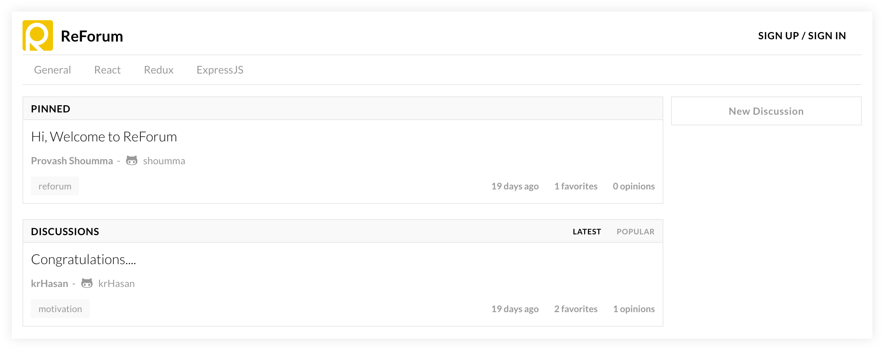

## This is a web3 forum based on ipfs.
You can visit this forum by any ipfs gateway (like ipfs.io,hub.textile.io), or installing ipfs application.  
You can regeister,login, post topics,reply discussions in this forum.   
If you are in network restict area,though you cannot send any message,but you can browser discussions which are updated in one minute.  
This is a new form of future forum.  

## Demo
 [website address](https://hub.textile.io/ipns/bafzbeib2jvsythibag52rncf56qflqye6iekponbt3u7txcbv2oz45sy5e/index.html)
 If the website address cannot be visited,it may be invalid because of unsteady ipns service in textile,it will be solved soon.
 Here is web2 domain url.
 [domain url](https://bbs.reforumipfs.online/)
## I have explored some convenient standards in this web3 based on ipfs.
* first,front and back system must be separate.  
* second,back system need generate json file which can be uploaded by ipfs,and visited by front page.  
* third,these json files' name should be uploaded in a standard method: I use keccak256 form of string like "{'url':'/api/form'}".  
* fourth,you should add a api to get the network status, then you can judge whether to use keccak256 value instead of common api request.  
* fifth,you should not upload some sensitive json file like user inforamtion.  
* sixth,please use java web token to verify user' identity,because you must solve cors problem.
* seventh, you should use relative path to support kindles of url.
  

# Thanks
Thanks for [Provash Shoumma](https://twitter.com/proshoumma) who provided open source code.

# ReForum
A minimal forum application built with the following technologies:
* [React](https://facebook.github.io/react/)
* [Redux](http://redux.js.org/)
* [Webpack](https://webpack.js.org/)
* [ExpressJS](https://expressjs.com/)
* [PassportJS](http://passportjs.org/)
* [MongoDB](https://www.mongodb.com/)

### Application Features
* Users can post a discussion
* Users can reply their opinions regarding discussion
* Users can favorite discussions
* Users have their own profile page
* Admin can create new forum categories
* Admin have a lot of power over every users discussions and opinions :-p

### Documentations
* [API Docs](https://github.com/shoumma/ReForum/blob/master/docs/api.md)
* [System Overview](https://github.com/shoumma/ReForum/blob/master/docs/system_overview.md)

### Home View


### Admin View


## Deploy on you own server

Please make sure you have following software installed in your system:
* Node.js > 6.0
* NPM / Yarn
* Git
* MongoDB

First we need to clone the repository:
```
$ git clone https://github.com/ReForum-ipfs/ReForum-ipfs
```

Then we have to install the necessary dependencies using either NPM or Yarn:
```
$ npm i
```
```
$ yarn
```

Now, we need to configure the credentials inside of the codebase. Open the file `config/credentials.js` add the necessary information. The file looks like this:
```js
module.exports = {
  DBURL: '',
};
```
We need to provide all the information here. You can notice that we need the database url here too. My `local` MongoDB url looks like:
```
mongodb://localhost:27017/reforum
```
Then, we need to configure the env file of the codebase.Open the file 'frontend/env.js' add the necessawry server information.The file looks like this:
```js
export default {
    url:'http://localhost:8080'    
}
```
You need to replace the server dns domain or ip addr of 'localhost'.

And we should install textile(https://textile.io/ )'s hub(https://docs.textile.io/hub/accounts/ ),please enter command line 'hub init' to register your account,and then 'hub buck init' in this '/public' path.

Then start a crontab task to copy json file to public,And use 'hub buck watch' to update files quickly.

Now we are ready to run the application. You can run either run the development environment of the application which will include Hot-Reload for JS codes using Webpack and the Redux dev tool extension, or you can run the production edition. The default port for developer edition is `8080`, and for production is `process.env.PORT`.

To run the app in development environment:
```
$ npm run start:dev
```

To run the app in production environment:
```
$  npm run build
in frontendnew create dist files then copy build files to /public path.
$ npm run start 
or to run in background:
$ pm2 start npm --run start 
```

Now, if you visit [http://localhost:8080](http://localhost:8080) (if you ran the dev), or the production URL, you will see that the application is up and running. Congratulation! But, wait a minute, it's showing you `Sorry, couldn't find the forum`. That is because, we didn't create any forum yet. You can now sign up via github and then visit the admin panel with the url [http://localhost:8080/admin](http://localhost:8080/admin). The application is currently configured in a way that, the first user will become the admin for the system.

Here we can create new forums and that forum will be displayed in the application. The first forum will be used as default forum.

Congratulation! You now have a clone of this application in your server. :-)


## License
[MIT License](https://github.com/shoumma/Mister-Poster/blob/master/LICENSE). Do whatever you want to do. :-)


## Path for Future Work
Welcome everyone to commit your opinon.This is a open platform.
